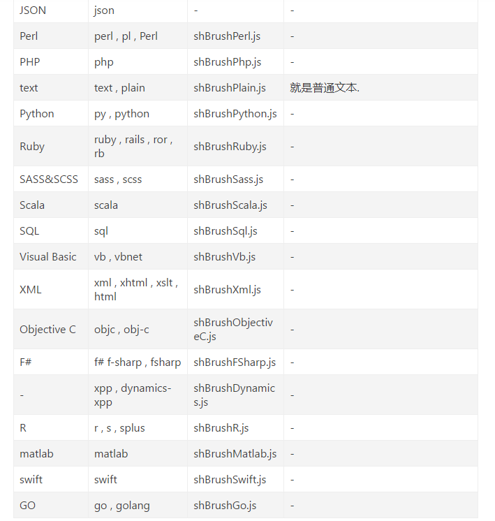
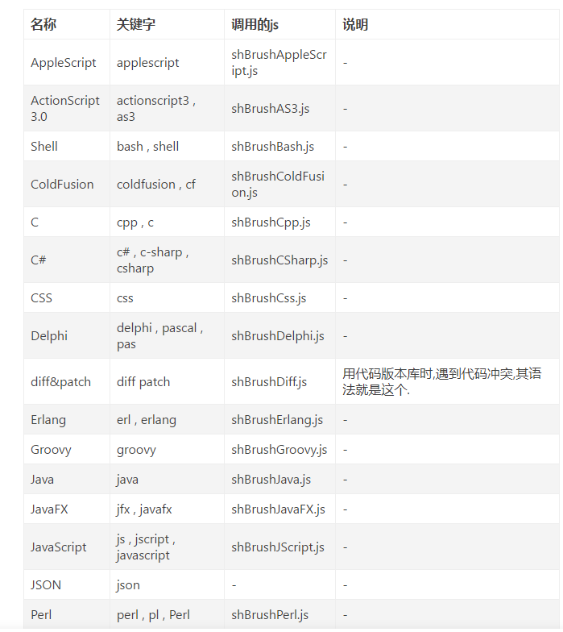

# Usedknowledge

## terminal

add new file --- touch

annotation:
* '#' for a line
* << more line


## markdown

* [annotations](https://blog.csdn.net/wcy23580/article/details/84885989)


* 返回上级目录:

    * cd ..返回上级目录（更高一级目录）

    * cd  / （返回上级目录）

    * cd  // （返回上上级目录）

    * cd home （进入home文件夹）

    * cd zdxh （进入zdxh文件夹）

* code edit
[code key word](https://www.jianshu.com/p/1f223eb78ad8)




## rust

## tools
* tree:gained constructure////

```
taolijie@taolijie-VirtualBox:~/Desktop/rcore/Rcore$ tree os
os
├── Cargo.lock
├── Cargo.toml
├── src
│   └── main.rs
└── target
    ├── CACHEDIR.TAG
    ├── debug
    │   ├── build
    │   ├── deps
    │   │   ├── os-c4e64d229733e3a7
    │   │   └── os-c4e64d229733e3a7.d
    │   ├── examples
    │   ├── incremental
    │   │   └── os-16na5df11z2at
    │   │       ├── s-g6ee7wb5z1-tior5d-3mt5urwuikri5
    │   │       │   ├── 112kg9buoe2lo44n.o
    │   │       │   ├── 18q92oyfnj4furb8.o
    │   │       │   ├── 2y3i1vht6gdp2gew.o
    │   │       │   ├── 33500th6d3sbqqsq.o
    │   │       │   ├── 3n1ymy2pxpgql4cu.o
    │   │       │   ├── 4c5rlul3obj6dbi3.o
    │   │       │   ├── 4ke7su1k8n4m5z4b.o
    │   │       │   ├── 5ct6kaxeqdsq7o2p.o
    │   │       │   ├── dep-graph.bin
    │   │       │   ├── query-cache.bin
    │   │       │   └── work-products.bin
    │   │       └── s-g6ee7wb5z1-tior5d.lock
    │   ├── os
    │   └── os.d
    └── riscv64gc-unknown-none-elf
        ├── CACHEDIR.TAG
        └── debug
            ├── build
            ├── deps
            │   └── os-1ee2bc86448aa2d0.d
            ├── examples
            └── incremental
                └── os-13pmrkog1x3iv
                    ├── s-g6efru2qsi-21jecb.lock
                    └── s-g6efru2qsi-21jecb-working
                        └── dep-graph.part.bin

17 directories, 24 files
```
