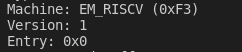

# ch1 Application Execution Environment and Platform Support

## essential information

* reference to [rCore](https://rcore-os.github.io/rCore-Tutorial-Book-v3/chapter1/1app-ee-platform.html) --Tsinghua University

use [rCore-virtual-3](https://rcore-os.github.io/rCore-Tutorial-deploy/docs/pre-lab/gdb.html)

* Rust nightly ,qemu,et al.
* win10 and virual ubuntu18.4
* vscode 


## reasons of using Rust 
> * Rust 语言标准库–std 是让 Rust 语言开发的软件具备可移植性的基础，类似于 C 语言的 LibC 标准库。它是一组小巧的、经过实践检验的共享抽象，适用于更广泛的 Rust 生态系统开发。它提供了核心类型，如 Vec 和 Option、类库定义的语言原语操作、标准宏、I/O 和多线程等。默认情况下，我们可以使用 Rust 语言标准库来支持 Rust 应用程序的开发。但 Rust 语言标准库的一个限制是，它需要有操作系统的支持。所以，如果你要实现的软件是运行在裸机上的操作系统，就不能直接用 Rust 语言标准库了。
> * Rust 有一个对 Rust 语言标准库–std 裁剪过后的 Rust 语言核心库 core。core库是不需要任何操作系统支持的，它的功能也比较受限，但是也包含了 Rust 语言相当一部分的核心机制，可以满足我们的大部分功能需求。Rust 语言是一种面向系统（包括操作系统）开发的语言，所以在 Rust 语言生态中，有很多三方库也不依赖标准库 std 而仅仅依赖核心库 core。对它们的使用可以很大程度上减轻我们的编程负担。它们是我们能够在裸机平台挣扎求生的最主要倚仗，也是大部分运行在没有操作系统支持的 Rust 嵌入式软件的必备。

## 现代编译器

>一个现代编译器的主要工作流程如下：
源代码（source code）→ 预处理器（preprocessor）→ 编译器（compiler）→ 汇编程序（assembler）→ 目标代码（object code）→ 链接器（linker）→ 可执行文件（executables），最后打包好的文件就可以给电脑去判读运行了

## create basic and  remote reference from x86_64
*  basic operation:
**step 1:**
```
cargo new os --bin
```
* --bin means root is src/main.rs

**step 2:**
```
cd os 
cargo run
```
it run with defult one this time 

**step 3:**
```
rustc --print target-list | grep riscv
```

**step 4:**
```
rustc --print target-list | grep riscv
cargo run --target riscv64gc-unknown-none-elf
```
result:
>error[E0463]: can't find crate for `std`
  |
  = note: the `riscv64gc-unknown-none-elf` target may not support the standard library
  = note: `std` is required by `os` because it does not declare `#![no_std]`
  = help: consider building the standard library from source with `cargo build -Zbuild-std`

>error: cannot find macro `println` in this scope
 --> src/main.rs:2:5
  |
2 |     println!("Hello, world!");
  |     ^^^^^^^

>error: `#[panic_handler]` function required, but not found

>For more information about this error, try `rustc --explain E0463`.
error: could not compile `os` due to 3 previous errors

**step 5:**
create file "config"
```
mkdir .cargo #attention :this is .cargo but not cargo
vim config
```
```
#wirte in config 
[build]
target="riscv64gc-unknown-none-elf"
```
**step 6:**
```
cd ..
cd src
vim lang_items.rs
```

**step 7:**
```
// write in os/src/lang_items.rs
use core::panic::PanicInfo;

#[panic_handler]
fn panic(_info: &PanicInfo)->!{
    loop{}
}

//os/src/main.rs
#![no_std] 
#![no_main]

mod lang_items;
```

**step 8:**
```bash
cargo build
```
result:
> Compiling os v0.1.0 (/home/taolijie/Desktop/rcore/Rcore/os)
>    Finished dev [unoptimized + debuginfo] target(s) in 0.70s

**analyse**
```bash
#cd os
file target/riscv64gc-unknown-none-elf/debug/os
rust-readobj -h target/riscv64gc-unknown-none-elf/debug/os
rust-objdump -s target/riscv64gc-unknown-none-elf/debug/os
```



0 means NULL or nullptr,it is  NULL


## write first code 

view  [rCore](https://rcore-os.github.io/rCore-Tutorial-Book-v3/chapter1/1app-ee-platform.html)  for more information

1. unable to download 
```bash
 qemu-system-riscv64 \
>     -machine virt \
>     -nographic \
>     -bios ../bootloader/rustsbi-qemu.bin \
>     -device loader,file=target/riscv64gc-unknown-none-elf/release/os.bin,addr=0x80200000 \
>     -s -S
qemu-system-riscv64: Unable to load the RISC-V firmware "../bootloader/rustsbi-qemu.bin"
```
  *  change `../bootloader/rustsbi-qemu.bin` to `default`, but can't run
  

## view information with rust-objdump

```bash
rust-objdump target/riscv64imac-unknown-none-elf/debug/os -x --arch-name=riscv64

target/riscv64imac-unknown-none-elf/debug/os:   file format elf64-littleriscv
architecture: riscv64
# 程序的入口地址
start address: 0x0000000000011120 

#Program Header：程序加载时所需的段信息
#其中的 off 是它在文件中的位置，vaddr 和 paddr 是要加载到的虚拟地址和物理地址，align 规定了地址的对齐，filesz 和 memsz 分别表示它在文件和内存中的大小，flags 描述了相关权限（r 表示可读，w 表示可写，x 表示可执行）
Program Header:
    PHDR off    0x0000000000000040 vaddr 0x0000000000010040 paddr 0x0000000000010040 align 2**3
         filesz 0x00000000000000e0 memsz 0x00000000000000e0 flags r--
    LOAD off    0x0000000000000000 vaddr 0x0000000000010000 paddr 0x0000000000010000 align 2**12
         filesz 0x0000000000000120 memsz 0x0000000000000120 flags r--
    LOAD off    0x0000000000000120 vaddr 0x0000000000011120 paddr 0x0000000000011120 align 2**12
         filesz 0x0000000000000004 memsz 0x0000000000000004 flags r-x
   STACK off    0x0000000000000000 vaddr 0x0000000000000000 paddr 0x0000000000000000 align 2**64
         filesz 0x0000000000000000 memsz 0x0000000000000000 flags rw-

Dynamic Section:

#Sections：从这里我们可以看到程序各段的各种信息。后面以 debug 开头的段是调试信息
Sections:
Idx Name              Size     VMA              Type
  0                   00000000 0000000000000000 
  1 .text             00000004 0000000000011120 TEXT
  2 .debug_abbrev     00000113 0000000000000000 DEBUG
  3 .debug_info       00000542 0000000000000000 DEBUG
  4 .debug_aranges    00000040 0000000000000000 DEBUG
  5 .debug_ranges     00000030 0000000000000000 DEBUG
  6 .debug_str        00000408 0000000000000000 DEBUG
  7 .debug_pubnames   000000b8 0000000000000000 DEBUG
  8 .debug_pubtypes   000002ec 0000000000000000 DEBUG
  9 .riscv.attributes 0000002b 0000000000000000 
 10 .debug_frame      00000050 0000000000000000 DEBUG
 11 .debug_line       00000067 0000000000000000 DEBUG
 12 .comment          00000013 0000000000000000 
 13 .symtab           00000150 0000000000000000 
 14 .shstrtab         000000b7 0000000000000000 
 15 .strtab           0000002c 0000000000000000 

#SYMBOL TABLE：符号表，从中我们可以看到程序中所有符号的地址。例如 _start 函数就位于入口地址上

SYMBOL TABLE:
0000000000000000 l    df *ABS*  0000000000000000 1z7jek7q0s59glk
0000000000011120 l       .text  0000000000000000 
0000000000011120 l       .text  0000000000000000 
0000000000011120 l       .text  0000000000000000 
0000000000011120 l       .text  0000000000000000 
0000000000011124 l       .text  0000000000000000 
0000000000011124 l       .text  0000000000000000 
0000000000000000 l       .debug_info    0000000000000000 
0000000000000000 l       .debug_line    0000000000000000 .Lline_table_start0
0000000000000000 l       .debug_ranges  0000000000000000 
0000000000011124 l       .text  0000000000000000 
0000000000000000 l       .debug_frame   0000000000000000 
0000000000011120 g     F .text  0000000000000004 _start
```
  

  ```bash
  rust-objdump target/riscv64imac-unknown-none-elf/debug/os -d --arch-name=riscv64

target/riscv64imac-unknown-none-elf/debug/os:   file format elf64-littleriscv
#here is little riscv!!!!!!
#表示elf64小端。一般arm，riscv，x86都是小端，小端是比较主流的。 

Disassembly of section .text:

0000000080200000 <text_start>:
80200000: 09 a0         j       0x80200002 <text_start+0x2>
80200002: 01 a0         j       0x80200002 <text_start+0x2>
  ```

```bash
  error: cannot find macro `global_asm` in this scope
  --> src/main.rs:19:1
   |
19 | global_asm!(include_str!("entry.asm"));
   | ^^^^^^^^^^
   |
   = note: consider importing this macro:
           core::arch::global_asm
```
add `use core::arch::global_asm `in main.rs

then we get two warning :
```bash
warning: use of deprecated macro `llvm_asm`: will be removed from the compiler, use asm! instead
  --> src/main.rs:39:9
   |
39 |         llvm_asm!("ecall"
   |         ^^^^^^^^
   |
   = note: `#[warn(deprecated)]` on by default

warning: the feature `global_asm` has been stable since 1.59.0 and no longer requires an attribute to enable
  --> src/main.rs:16:12
   |
16 | #![feature(global_asm)]
   |            ^^^^^^^^^^
   |
   = note: `#[warn(stable_features)]` on by default

warning: `os` (bin "os") generated 2 warnings
    Finished dev [unoptimized + debuginfo] target(s) in 0.19s

OpenSBI v0.6
```